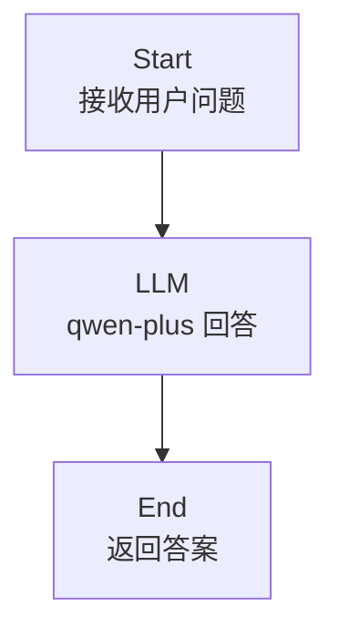
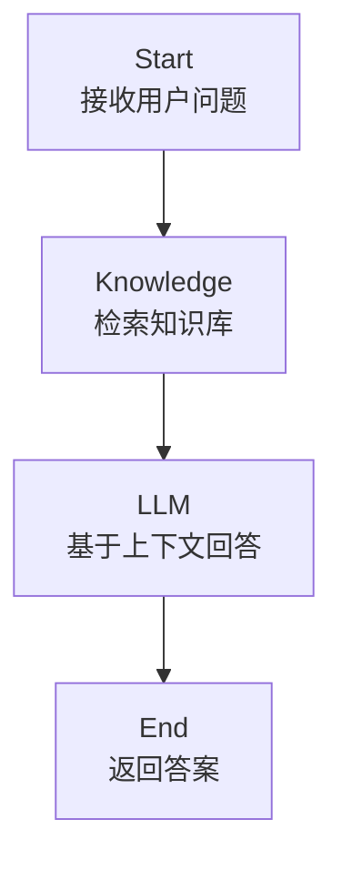
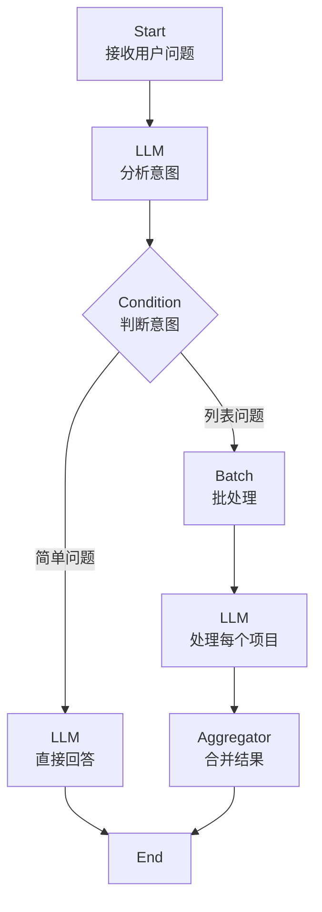

# 项目测试指南

## 环境准备

### 1. 前置依赖

- JDK 21+
- Maven 3.8+
- MySQL 8.0+
- (可选) Chroma 向量库

### 2. 数据库配置

创建数据库并执行初始化脚本：

```sql
CREATE DATABASE `agent-plus` DEFAULT CHARACTER SET utf8mb4 COLLATE utf8mb4_unicode_ci;
```

然后执行 `doc/sql/ai-knowledge-model.sql` 脚本初始化表结构。

### 3. API Key 配置

在 `application-dev.yml` 或环境变量中配置：

```yaml
# 千问 API Key
dashscope:
  api-key: your-dashscope-api-key-here

# 豆包 API Key（可选）
doubao:
  api-key: your-doubao-api-key-here
```

或通过环境变量配置：
```bash
export DASHSCOPE_API_KEY=your-api-key
export DOUBAO_API_KEY=your-doubao-api-key
```

### 4. (可选) 启动 Chroma 向量库

如果需要测试知识库功能：

```bash
# 使用 Docker 启动 Chroma
docker run -d -p 8000:8000 chromadb/chroma:latest
```

然后在配置文件中启用：
```yaml
chroma:
  enabled: true
  url: http://localhost:8000
```

## 快速开始

### 方式 1：运行单元测试（推荐）

```bash
cd agent-plus-engine

# 编辑 WorkflowQuickTest.java，设置 API Key（可选）
# 或设置环境变量 export DASHSCOPE_API_KEY=...

# 运行快速测试
mvn test -Dtest=WorkflowQuickTest
```

### 方式 2：运行完整应用

```bash
cd agent-plus-web
mvn spring-boot:run -Dspring-boot.run.profiles=dev
```

启动后，访问 Swagger UI:
```
http://localhost:8080/swagger-ui.html
```

## 测试流程设计

### 测试流程 1：简单问答（无知识库）



**流程描述：**
- 用户输入问题
- 直接调用 LLM 回答
- 返回结果

**节点配置：**
1. **Start**: 接收用户问题
2. **LLM**: 使用 qwen-plus 回答问题
3. **End**: 返回答案

**测试输入：**
```json
{
  "question": "什么是 Agent AI？"
}
```

---

### 测试流程 2：带知识库的 RAG 问答



**流程描述：**
- 用户输入问题
- 从知识库检索相关文档
- 将检索到的文档作为上下文
- 调用 LLM 生成回答
- 返回结果

**节点配置：**
1. **Start**: 接收用户问题
2. **Knowledge**: 从知识库检索相关内容
3. **LLM**: 基于检索结果回答
4. **End**: 返回答案

**测试输入：**
```json
{
  "question": "产品如何定价？"
}
```

---

### 测试流程 3：条件分支 + 批处理



**流程描述：**
- 用户输入问题
- LLM 分析意图
- 根据意图走不同分支
- 如果是列表类问题，使用批处理处理每个项目
- 合并结果返回

**节点配置：**
1. **Start**: 接收用户问题
2. **LLM (分析意图)**: 分析用户问题类型
3. **Condition**: 根据意图分支
4. **LLM (简单回答)**: 简单问题直接回答
5. **Batch**: 复杂列表问题批处理
   - 子图 LLM: 处理每个项目
6. **Aggregator**: 合并批处理结果
7. **End**: 返回最终答案

---

## 主要 API

- `POST /api/flow/execute` - 执行工作流
- `GET /api/flow/{id}` - 获取工作流定义
- `POST /api/knowledge/documents` - 上传文档到知识库

---

## 测试检查清单

- [ ] 简单问答流程正常工作
- [ ] 知识库检索功能正常（如果启用）
- [ ] 批处理子图正常执行
- [ ] 条件分支逻辑正确
- [ ] 支持千问模型
- [ ] 支持豆包模型
- [ ] 输出参数正确映射
- [ ] 模板变量正确替换
