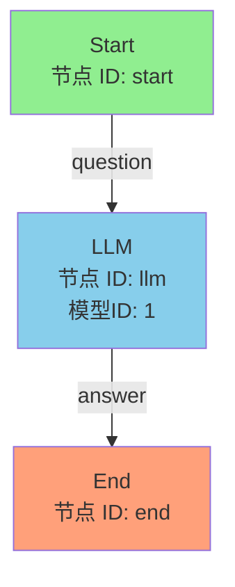
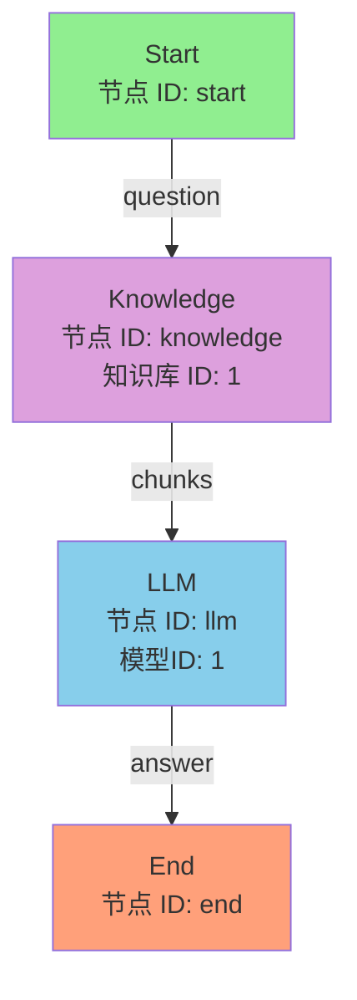
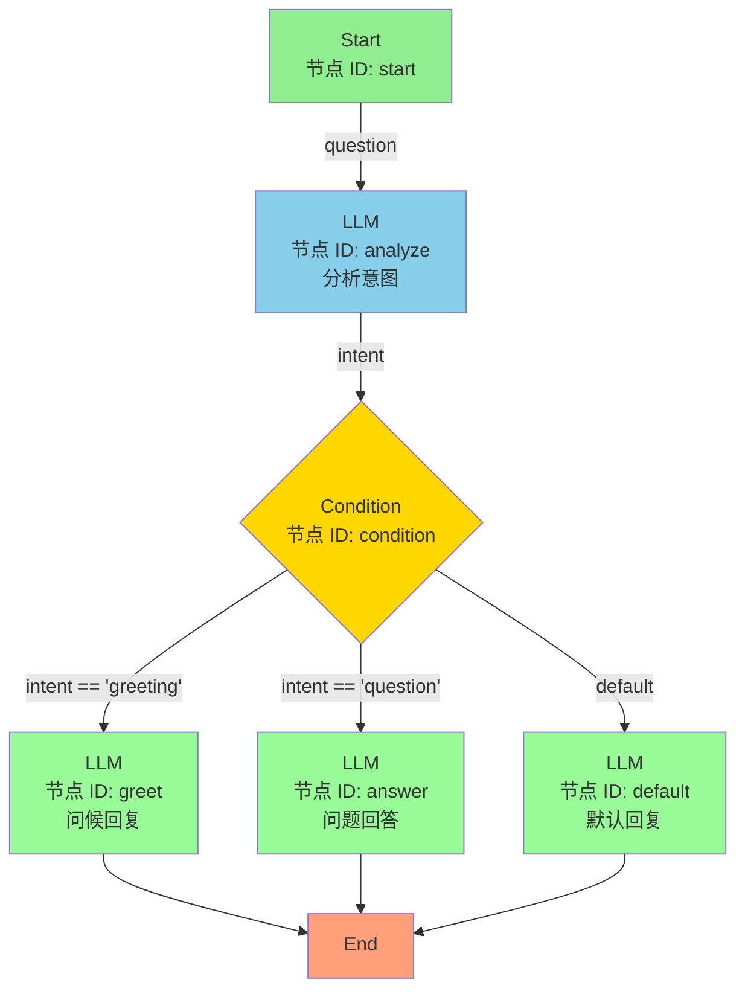
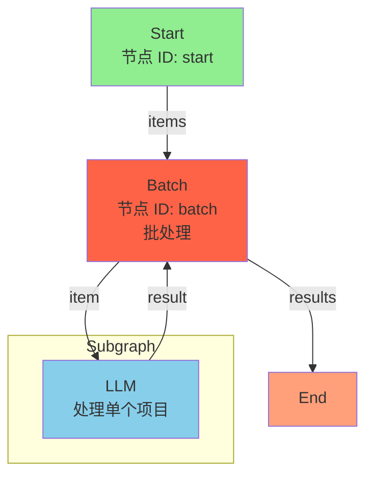
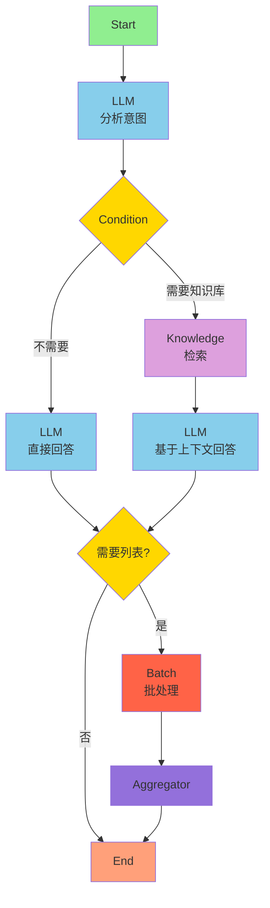

# Agent Plus 测试流程图

本文档包含用于测试 Agent Plus 工作流引擎的流程图设计。

---

## 1. 简单问答流程



**工作流 JSON 示例：**

> 关键约定：
> - `type` 首字母大写（`Start`/`LLM`/`End`），对应 `FlowNodeType` 的 code。
> - LLM 节点用 `modelId`（Long，`ai_model` 表主键）指定模型，不是模型名；`modelName` 仅作展示。
> - 占位符 `{{query}}` 中的 `query` **必须是本节点 `inputParams` 里声明的参数名**，该参数再通过 `paramMapKey` 绑定上游节点的输出。
> - `End` 节点用 `outputParams` + `paramMapKey` 引用某节点的输出，**没有 `value` 模板字段**。
> - LLM 节点默认输出 `text`（模型文本）、`reasoningContent`、`usage`，下游可直接引用 `text`。

```json
{
  "nodes": [
    {
      "id": "start",
      "type": "Start",
      "label": "开始",
      "data": {
        "label": "开始",
        "description": "流程入口",
        "inputParams": [
          {"name": "query", "type": "string", "description": "用户问题", "required": false}
        ]
      }
    },
    {
      "id": "node-LLM-1",
      "type": "LLM",
      "data": {
        "label": "大模型",
        "modelId": 1,
        "temperature": 0.7,
        "systemPrompt": "你是一个乐于助人的AI助手。",
        "userPrompt": "{{query}}",
        "inputParams": [
          {"name": "query", "type": "string", "paramMapKey": {"nodeId": "start", "name": "query", "type": "string"}}
        ],
        "outputParams": [],
        "timeout": 60,
        "retryCount": 0,
        "errorHandling": "stop"
      }
    },
    {
      "id": "end",
      "type": "End",
      "label": "结束",
      "data": {
        "label": "结束",
        "description": "工作流程完成。",
        "outputParams": [
          {"name": "answer", "type": "string", "paramMapKey": {"nodeId": "node-LLM-1", "name": "text", "type": "string"}}
        ]
      }
    }
  ],
  "edges": [
    {"id": "e1", "source": "start", "target": "node-LLM-1"},
    {"id": "e2", "source": "node-LLM-1", "target": "end"}
  ]
}
```

---

## 2. RAG 知识库问答流程



**工作流 JSON 示例：**

```json
{
  "nodes": [
    {
      "id": "start",
      "type": "Start",
      "label": "开始",
      "data": {
        "label": "开始",
        "description": "流程入口",
        "inputParams": [
          {"name": "query", "type": "string", "description": "用户问题", "required": false}
        ]
      }
    },
    {
      "id": "node-Knowledge-1",
      "type": "Knowledge",
      "data": {
        "label": "知识库",
        "knowledgeIds": [1],
        "topK": 5,
        "inputParams": [
          {"name": "query", "type": "string", "paramMapKey": {"nodeId": "start", "name": "query", "type": "string"}}
        ],
        "outputParams": []
      }
    },
    {
      "id": "node-LLM-1",
      "type": "LLM",
      "data": {
        "label": "大模型",
        "modelId": 1,
        "temperature": 0.7,
        "systemPrompt": "基于以下上下文回答用户问题。如果上下文中没有相关信息，请坦率告知。",
        "userPrompt": "上下文：\n{{contextText}}\n\n用户问题：{{query}}",
        "inputParams": [
          {"name": "query", "type": "string", "paramMapKey": {"nodeId": "start", "name": "query", "type": "string"}},
          {"name": "contextText", "type": "string", "paramMapKey": {"nodeId": "node-Knowledge-1", "name": "contextText", "type": "string"}}
        ],
        "outputParams": [],
        "timeout": 60,
        "retryCount": 0,
        "errorHandling": "stop"
      }
    },
    {
      "id": "end",
      "type": "End",
      "label": "结束",
      "data": {
        "label": "结束",
        "description": "工作流程完成。",
        "outputParams": [
          {"name": "answer", "type": "string", "paramMapKey": {"nodeId": "node-LLM-1", "name": "text", "type": "string"}}
        ]
      }
    }
  ],
  "edges": [
    {"id": "e1", "source": "start", "target": "node-Knowledge-1"},
    {"id": "e2", "source": "node-Knowledge-1", "target": "node-LLM-1"},
    {"id": "e3", "source": "node-LLM-1", "target": "end"}
  ]
}
```

> 说明：Knowledge 节点会把 `KnowledgeRetrieveResult` 整体展开为输出，可引用的字段有 `chunks`（召回切片列表）、`contextText`（预拼接好的上下文文本，推荐直接喂给 LLM）、`totalHit`、`query`、`rewriteQuery` 等。上例用 `{{contextText}}` 引用拼好的上下文，前提是 LLM 的 `inputParams` 已声明 `contextText` 并用 `paramMapKey` 绑定到 Knowledge 节点的 `contextText` 输出。知识库 ID 用 `knowledgeIds` 数组配置（支持多知识库联合检索）。

---

## 3. 条件分支流程



**工作流 JSON 示例：**

> 关键约定：
> - 条件写在 `conditions[]` 中，每个条件含 `id`、`logic`(`and`/`or`) 与 `rules[]`；规则里 `variable` 用 `{nodeId,name,type}` 引用上游输出，配合 `operator`(如 `contains`/`equals`) 和 `value`。
> - 分支走向由**边的 `sourceHandle`** 决定：命中某条件时 `sourceHandle: "condition:<该条件的 id>"`，否则走 `sourceHandle: "else"`。Condition 节点本身不写 `target`/`defaultTarget`。

```json
{
  "nodes": [
    {
      "id": "start",
      "type": "Start",
      "label": "开始",
      "data": {
        "label": "开始",
        "inputParams": [
          {"name": "query", "type": "string", "description": "用户输入", "required": false}
        ]
      }
    },
    {
      "id": "node-LLM-analyze",
      "type": "LLM",
      "data": {
        "label": "分析意图",
        "modelId": 1,
        "temperature": 0.7,
        "systemPrompt": "根据用户说的：{{query}}\n分析意图，返回意图数组。",
        "userPrompt": "{{query}}",
        "inputParams": [
          {"name": "query", "type": "string", "paramMapKey": {"nodeId": "start", "name": "query", "type": "string"}}
        ],
        "outputParams": [
          {"name": "intention", "type": "array", "description": "意图"}
        ],
        "timeout": 60,
        "retryCount": 0,
        "errorHandling": "stop"
      }
    },
    {
      "id": "node-Condition-1",
      "type": "Condition",
      "data": {
        "label": "条件分支",
        "conditions": [
          {
            "id": "condition-greeting",
            "logic": "and",
            "rules": [
              {"id": "rule-1", "variable": {"nodeId": "node-LLM-analyze", "name": "intention", "type": "array"}, "operator": "contains", "value": "问候"}
            ]
          }
        ]
      }
    },
    {
      "id": "node-LLM-greet",
      "type": "LLM",
      "data": {
        "label": "问候回复",
        "modelId": 1,
        "systemPrompt": "友好地问候用户。",
        "userPrompt": "{{query}}",
        "inputParams": [
          {"name": "query", "type": "string", "paramMapKey": {"nodeId": "start", "name": "query", "type": "string"}}
        ],
        "outputParams": []
      }
    },
    {
      "id": "node-LLM-default",
      "type": "LLM",
      "data": {
        "label": "默认回复",
        "modelId": 1,
        "systemPrompt": "礼貌地告知用户暂时无法理解。",
        "userPrompt": "{{query}}",
        "inputParams": [
          {"name": "query", "type": "string", "paramMapKey": {"nodeId": "start", "name": "query", "type": "string"}}
        ],
        "outputParams": []
      }
    },
    {
      "id": "end",
      "type": "End",
      "label": "结束",
      "data": {
        "label": "结束",
        "outputParams": [
          {"name": "greetReply", "type": "string", "paramMapKey": {"nodeId": "node-LLM-greet", "name": "text", "type": "string"}},
          {"name": "defaultReply", "type": "string", "paramMapKey": {"nodeId": "node-LLM-default", "name": "text", "type": "string"}}
        ]
      }
    }
  ],
  "edges": [
    {"id": "e1", "source": "start", "target": "node-LLM-analyze"},
    {"id": "e2", "source": "node-LLM-analyze", "target": "node-Condition-1"},
    {"id": "e3", "source": "node-Condition-1", "target": "node-LLM-greet", "sourceHandle": "condition:condition-greeting"},
    {"id": "e4", "source": "node-Condition-1", "target": "node-LLM-default", "sourceHandle": "else"},
    {"id": "e5", "source": "node-LLM-greet", "target": "end"},
    {"id": "e6", "source": "node-LLM-default", "target": "end"}
  ]
}
```

---

## 4. 批处理流程



**工作流 JSON 示例：**

> 关键约定：
> - 批处理子节点不是内嵌 `subgraph`，而是普通节点，通过 `parentNode`(指向 Batch 节点 id) + `extent: "parent"` 归属于 Batch。
> - Batch 节点 `inputParams` 声明要遍历的数组（`paramMapKey` 绑定上游数组输出）。
> - 子节点取当前遍历项时，`paramMapKey` 用 `{nodeId: <batch节点id>, name: "item"}`。
> - Batch 节点 `outputParams` 收集结果，`paramMapKey` 指向子图**末端节点**的输出。
> - 边的 `sourceHandle`/`targetHandle`：外部进出用 `batch-external-target`/`batch-external-source`，内部子图首尾用 `batch-internal-source`/`batch-internal-target`。
> - 无需单独的 Aggregator 节点，聚合由 Batch 自身的 `outputParams` 完成。

```json
{
  "nodes": [
    {
      "id": "start",
      "type": "Start",
      "label": "开始",
      "data": {
        "label": "开始",
        "inputParams": [
          {"name": "items", "type": "array", "description": "项目列表", "required": false}
        ]
      }
    },
    {
      "id": "node-Batch-1",
      "type": "Batch",
      "style": {"height": "470px", "width": "709px"},
      "data": {
        "label": "批处理",
        "maxParallel": 1,
        "inputParams": [
          {"name": "input", "type": "array", "paramMapKey": {"nodeId": "start", "name": "items", "type": "array"}}
        ],
        "outputParams": [
          {"name": "output", "type": "string", "description": "批处理结果数组", "paramMapKey": {"nodeId": "node-LLM-sub", "name": "text", "type": "string"}}
        ]
      }
    },
    {
      "id": "node-LLM-sub",
      "type": "LLM",
      "parentNode": "node-Batch-1",
      "expandParent": true,
      "extent": "parent",
      "data": {
        "label": "大模型-批处理",
        "modelId": 1,
        "temperature": 0.7,
        "systemPrompt": "处理这个项目。",
        "userPrompt": "处理：{{item}}",
        "inputParams": [
          {"name": "item", "type": "object", "paramMapKey": {"nodeId": "node-Batch-1", "name": "item", "type": "object"}}
        ],
        "outputParams": [],
        "timeout": 60,
        "retryCount": 0,
        "errorHandling": "stop"
      }
    },
    {
      "id": "end",
      "type": "End",
      "label": "结束",
      "data": {
        "label": "结束",
        "outputParams": [
          {"name": "resultList", "type": "array", "paramMapKey": {"nodeId": "node-Batch-1", "name": "output", "type": "array"}}
        ]
      }
    }
  ],
  "edges": [
    {"id": "e1", "source": "start", "target": "node-Batch-1", "targetHandle": "batch-external-target"},
    {"id": "e2", "source": "node-Batch-1", "target": "end", "sourceHandle": "batch-external-source"},
    {"id": "e3", "source": "node-Batch-1", "target": "node-LLM-sub", "sourceHandle": "batch-internal-source"},
    {"id": "e4", "source": "node-LLM-sub", "target": "node-Batch-1", "targetHandle": "batch-internal-target"}
  ]
}
```

---

## 5. 完整复杂流程



这个流程结合了：
- 意图分析
- 条件分支
- 知识库检索
- 批处理
- 结果聚合

---

## 快速测试

引擎模块内置两个端到端冒烟用例，使用 `MockChatModelProvider` / `MockKnowledgeRetriever`，**无需真实 API Key** 即可跑通编译 + 主图/子图装配 + 各节点连通：

- `WorkflowSmokeTest` — 加载 `src/test/resources/workflow-sample.json`（简单问答链路）
- `WorkflowBatchSmokeTest` — 加载 `src/test/resources/workflow-batch-sample.json`（批处理链路）

```bash
mvn -pl agent-plus-engine -am test -Dtest=WorkflowSmokeTest
mvn -pl agent-plus-engine -am test -Dtest=WorkflowBatchSmokeTest
```

> 样例 JSON 里的 `modelId`（如 `1`）在 Mock 场景下不会真正路由到模型；用例只断言 runId、最终输出、节点状态非空并打印每节点产物供人工核对。

或者启动主应用连真实模型与数据库跑流程：

```bash
cd agent-plus-web
mvn spring-boot:run -Dspring-boot.run.profiles=dev
```

然后访问 Swagger UI: http://localhost:8080/swagger-ui.html
