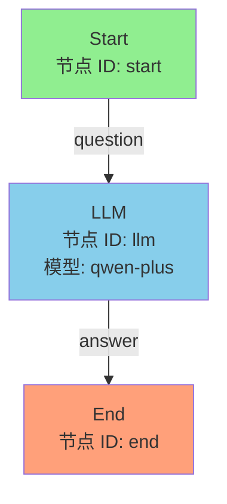
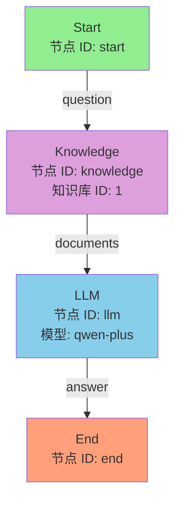
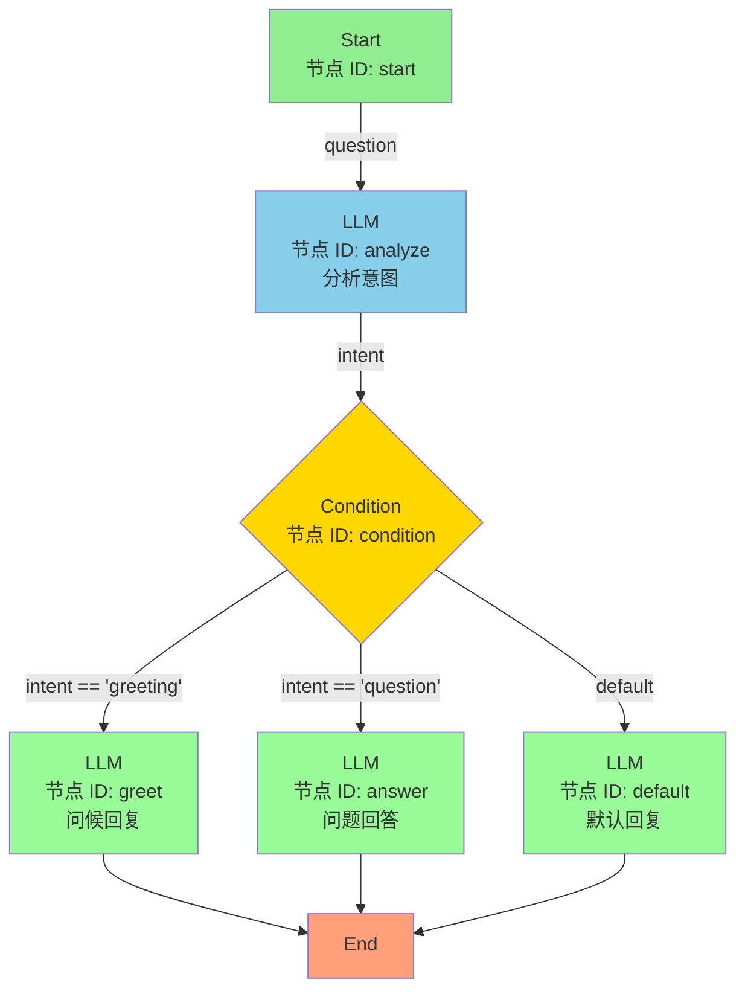
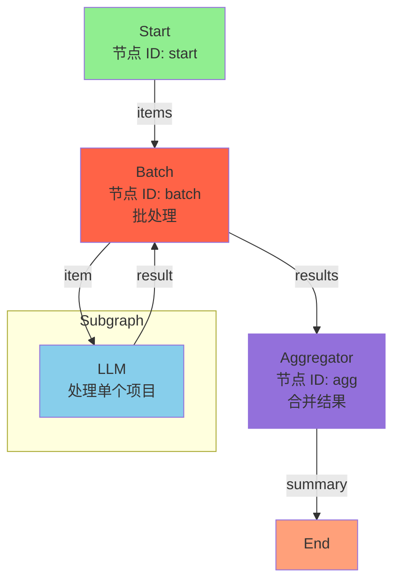
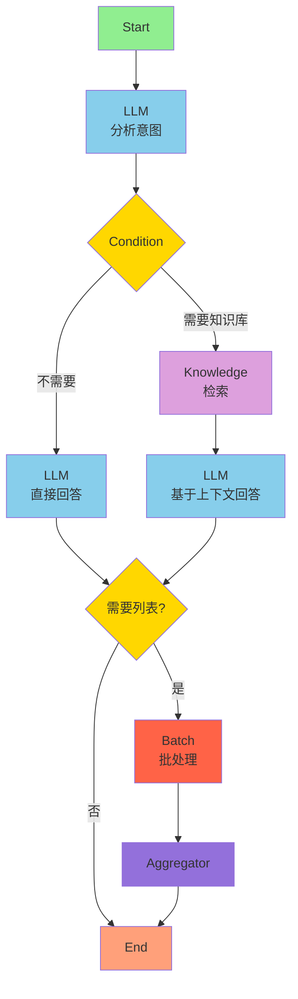

# Agent Plus 测试流程图

本文档包含用于测试 Agent Plus 工作流引擎的流程图设计。

---

## 1. 简单问答流程



**工作流 JSON 示例：**

```json
{
  "id": "simple-chat",
  "name": "简单问答",
  "nodes": [
    {
      "id": "start",
      "type": "start",
      "data": {
        "inputParams": [
          {"name": "question", "label": "用户问题", "type": "string"}
        ]
      }
    },
    {
      "id": "llm",
      "type": "llm",
      "data": {
        "model": "qwen-plus",
        "systemPrompt": "你是一个乐于助人的AI助手。",
        "userPrompt": "{{question}}",
        "temperature": 0.7,
        "outputParams": [
          {"name": "answer", "label": "回答", "type": "string"}
        ]
      }
    },
    {
      "id": "end",
      "type": "end",
      "data": {
        "outputParams": [
          {"name": "result", "label": "最终结果", "value": "{{llm.answer}}"}
        ]
      }
    }
  ],
  "edges": [
    {"id": "e1", "source": "start", "target": "llm"},
    {"id": "e2", "source": "llm", "target": "end"}
  ]
}
```

---

## 2. RAG 知识库问答流程



**工作流 JSON 示例：**

```json
{
  "id": "rag-chat",
  "name": "知识库问答",
  "nodes": [
    {
      "id": "start",
      "type": "start",
      "data": {
        "inputParams": [
          {"name": "question", "label": "用户问题", "type": "string"}
        ]
      }
    },
    {
      "id": "knowledge",
      "type": "knowledge",
      "data": {
        "knowledgeId": 1,
        "topK": 5,
        "inputParam": "question",
        "outputParam": "context"
      }
    },
    {
      "id": "llm",
      "type": "llm",
      "data": {
        "model": "qwen-plus",
        "systemPrompt": "基于以下上下文回答用户问题。如果上下文中没有相关信息，请坦率告知。",
        "userPrompt": "上下文：\n{{knowledge.context}}\n\n用户问题：{{question}}",
        "temperature": 0.7,
        "outputParams": [
          {"name": "answer", "label": "回答", "type": "string"}
        ]
      }
    },
    {
      "id": "end",
      "type": "end",
      "data": {
        "outputParams": [
          {"name": "result", "label": "最终结果", "value": "{{llm.answer}}"}
        ]
      }
    }
  ],
  "edges": [
    {"id": "e1", "source": "start", "target": "knowledge"},
    {"id": "e2", "source": "knowledge", "target": "llm"},
    {"id": "e3", "source": "llm", "target": "end"}
  ]
}
```

---

## 3. 条件分支流程



**工作流 JSON 示例：**

```json
{
  "id": "conditional-flow",
  "name": "条件分支流程",
  "nodes": [
    {
      "id": "start",
      "type": "start",
      "data": {
        "inputParams": [
          {"name": "question", "label": "用户输入", "type": "string"}
        ]
      }
    },
    {
      "id": "analyze",
      "type": "llm",
      "data": {
        "model": "qwen-plus",
        "systemPrompt": "分析用户输入的意图，返回JSON格式：{\"intent\": \"greeting|question|other\"}",
        "userPrompt": "{{question}}",
        "outputParams": [
          {"name": "intent", "label": "意图", "type": "string"}
        ]
      }
    },
    {
      "id": "condition",
      "type": "condition",
      "data": {
        "conditions": [
          {"field": "analyze.intent", "operator": "equals", "value": "greeting", "target": "greet"},
          {"field": "analyze.intent", "operator": "equals", "value": "question", "target": "answer"}
        ],
        "defaultTarget": "default"
      }
    },
    {
      "id": "greet",
      "type": "llm",
      "data": {
        "model": "qwen-plus",
        "systemPrompt": "友好地问候用户。",
        "userPrompt": "{{question}}",
        "outputParams": [{"name": "reply", "type": "string"}]
      }
    },
    {
      "id": "answer",
      "type": "llm",
      "data": {
        "model": "qwen-plus",
        "systemPrompt": "专业地回答用户问题。",
        "userPrompt": "{{question}}",
        "outputParams": [{"name": "reply", "type": "string"}]
      }
    },
    {
      "id": "default",
      "type": "llm",
      "data": {
        "model": "qwen-plus",
        "systemPrompt": "礼貌地告知用户暂时无法理解。",
        "userPrompt": "{{question}}",
        "outputParams": [{"name": "reply", "type": "string"}]
      }
    },
    {
      "id": "end",
      "type": "end",
      "data": {
        "outputParams": [
          {"name": "result", "value": "{{greet.reply or answer.reply or default.reply}}"}
        ]
      }
    }
  ],
  "edges": [
    {"id": "e1", "source": "start", "target": "analyze"},
    {"id": "e2", "source": "analyze", "target": "condition"},
    {"id": "e3", "source": "condition", "target": "greet", "condition": "greeting"},
    {"id": "e4", "source": "condition", "target": "answer", "condition": "question"},
    {"id": "e5", "source": "condition", "target": "default", "condition": "default"},
    {"id": "e6", "source": "greet", "target": "end"},
    {"id": "e7", "source": "answer", "target": "end"},
    {"id": "e8", "source": "default", "target": "end"}
  ]
}
```

---

## 4. 批处理流程



**工作流 JSON 示例：**

```json
{
  "id": "batch-flow",
  "name": "批处理流程",
  "nodes": [
    {
      "id": "start",
      "type": "start",
      "data": {
        "inputParams": [
          {"name": "items", "label": "项目列表", "type": "array"}
        ]
      }
    },
    {
      "id": "batch",
      "type": "batch",
      "data": {
        "inputParam": "items",
        "itemParam": "item",
        "outputParam": "processedItems",
        "subgraph": {
          "nodes": [
            {
              "id": "sub-llm",
              "type": "llm",
              "data": {
                "model": "qwen-plus",
                "userPrompt": "处理这个项目：{{item}}",
                "outputParams": [{"name": "processed", "type": "string"}]
              }
            }
          ],
          "edges": []
        }
      }
    },
    {
      "id": "agg",
      "type": "aggregator",
      "data": {
        "inputParam": "batch.processedItems",
        "outputParam": "summary",
        "aggregation": "join"
      }
    },
    {
      "id": "end",
      "type": "end",
      "data": {
        "outputParams": [
          {"name": "result", "value": "{{agg.summary}}"}
        ]
      }
    }
  ],
  "edges": [
    {"id": "e1", "source": "start", "target": "batch"},
    {"id": "e2", "source": "batch", "target": "agg"},
    {"id": "e3", "source": "agg", "target": "end"}
  ]
}
```

---

## 5. 完整复杂流程



这个流程结合了：
- 意图分析
- 条件分支
- 知识库检索
- 批处理
- 结果聚合

---

## 快速测试

使用 `WorkflowQuickTest` 类进行快速测试：

```bash
cd agent-plus-engine
export DASHSCOPE_API_KEY=your-api-key
mvn test -Dtest=WorkflowQuickTest
```

或者直接运行主应用：

```bash
cd agent-plus-web
mvn spring-boot:run -Dspring-boot.run.profiles=dev
```

然后访问 Swagger UI: http://localhost:8080/swagger-ui.html
